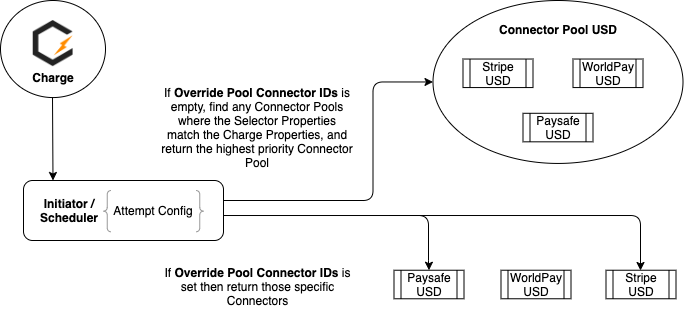

# ChargeHive Operation Overview
Here is a basic overview of how ChargeHive attempts Charges.

First an [Initiator or Scheduler](#schedulers) is selected based on the charge information.
This Initiator of Scheduler has an Attempt Config defined within it which will determine the [Connector or Connector Pool](#connectors) that will be used for this Charge. 

This Attempt Config has an `overridePoolConnectorIds` property. 
If this is set the Attempt Config will return the specific Connectors set in this property.
If this is not set the Attempt Config will determine a Connector Pool to use based on the Selector Properties on Connector Pools matching the Properties on the Charge. 





ChargeHive will attempt the Charge through the Connectors specifically defined in the Attempt Config, or work through the Connectors within the defined Connector Pool and return a result.

---

Configuration settings on the Attempt Config, Connector Pool and Connector will determine which Payment Methods to attempt, whether to Cascade to other Connectors, how many times to attempt the Charge on each Connector etc.

---

[Policies](#policies) setup within ChargeHive control what happens to charges throughout the charging process, for instance Fraud checking, Locking Payment Methods, when to stop attempting the Charge etc.

# Getting started on ChargeHive
* To get started on ChargeHive first create at least one [Connector](#connectors) for a Payment Processor (WorldPay, Stripe etc).
You can create a Connector for each Merchant Account you have with each Payment Processor.

* Next create Connector Pools which contain some or all of these Connectors, for instance putting all Connectors of one Currency in a Connector Pool for that Currency.

  Set the Selector on each Connector Pool to ensure it will only be selected for the Attempt Config if the Charge matches those filters (for instance Currency = USD).

  If you are creating multiple Connector Pools for similar criteria ensure you set the Priority in the Selector as well (with the lowest priority being selected first).

* Finally create an Attempt Config within an [Initiator or Scheduler](#schedulers), setting this to use a Connector Pool or specific [Connector or Connectors](#connectors).

At this point any Charges sent through to ChargeHive will run through the Initiator or Scheduler and based on the Attempt Config, get a list of Connectors to attempt the Charge, then attempt the Charge and return a result.  

## ChargeHive Configuration
Every object in ChargeHive, from *Initiators*, *ConnectorPools* to *Connectors* have a configuration file which is applied using the `chive` tool. 
Configurations can be saved, updated, loaded and deleted using the tool.

### Configuration File Structure
All configurations used in ChargeHive follow the same wrapper pattern:
```json5
{
  "kind": "KindOfConfig",      // [Required] Must be set to the kind of config as detailed in each config section below
  "metaData": {                // Contains general info about this config
    "projectId": "",           // [Required] Use the projectId you have been issued with from ChargeHive
    "name": "",                // [Required] Unique name of this configuration (string, no spaces, all lowercase)
    "displayName": "",         // Display name which will be shown in the front end
    "description": "",         // Long description of the config item
    "annotations": {           // Key value pairs for additional processing
      "key": "value"
    },
    "labels": {                // Key value pairs for front end grouping
      "key": "value"
    }
  },
  "specVersion": "v1",         // [Required] Must specify an API version
  "selector": {                // See the section below on selectors
    "priority": 0,
    "expressions": [
      {
        "key": "NameOfTheKey",
        "operator": "Equal",
        "conversion": "",
        "values": [
          "value1",
          "value2"
        ]
      }
    ]
  },
  "spec": {}                   // Configuration details specific to the kind of config
}
```
### Applying Configuration files
The configuration files are applied to your project by using the ChargeHive command line tool "`chive`"
For further information about how this is done, see the [chive](chive.md) documentation page.

## Configuration Selectors
Selectors are optional configurations at the heart of all ChargeHive objects. A priority value is available for pushing objects higher in the list. They provide a list of rules to match against a charge.
For more information see the [Selectors](selectors.md) section.

## Configuration Types
As all objects in ChargeHive use the same wrapper pattern, the `Kind` property is used to define what type of Configuration you are setting up. Below each Type of configuration is defined, and each will have a different `Kind` value to define them.

## Schedulers
+ [Initiator Scheduler](initiator.md) defines the first scheduler for a charge.
+ [On Demand Scheduler](scheduler/on_demand.md) defines schedules for arbitrary billing requests like always charge days.
+ [Refund Scheduler](scheduler/refund.md) defines the schedule of retrying refunds and the maximum number of attempts.
+ [Sequential Scheduler](scheduler/sequential.md) defines which connectors to attempt, in what order when processing a charge - usually used for Renewal charges.

## Connectors
+ [Connector](connectors/connector.md) is a configured external service like payment gateways or fraud services.
+ [ConnectorPool](connectors/pool.md) is a pool of connectors that can be used in an Attempt Config. 

## Policies
Policies setup within Chargehive control what happens to charges throughout the charging process.

+ [Cascade Policy](policy/cascade.md) defines how a failed charge retries with a different Connector.
+ [Charge Expiry Policy](policy/charge_expiry.md) defines how long a charge should last before expiring.
+ [Fraud Policy](policy/fraud.md) defines how and when a charge is checked for fraudulent characteristics using a Fraud Service Connector.
+ [Method Lock Policy](policy/method_lock.md) defines how long to block a payment method in the event of a decline or failure.
+ [Method Upgrade Policy](policy/method_upgrade.md) defines what modifications can be made to a payment method in order to complete a transaction.
+ [Method Verify Policy](policy/method_verify.md) defines how and when a card should be verified.
+ [SCA (Secure Customer Authentication) Policy](policy/sca.md) defines PSD2 SCA policy for transactions.

## Integration
+ [Slack](integration/slack.md) is an integration with the Slack messaging service for service/event notifications.